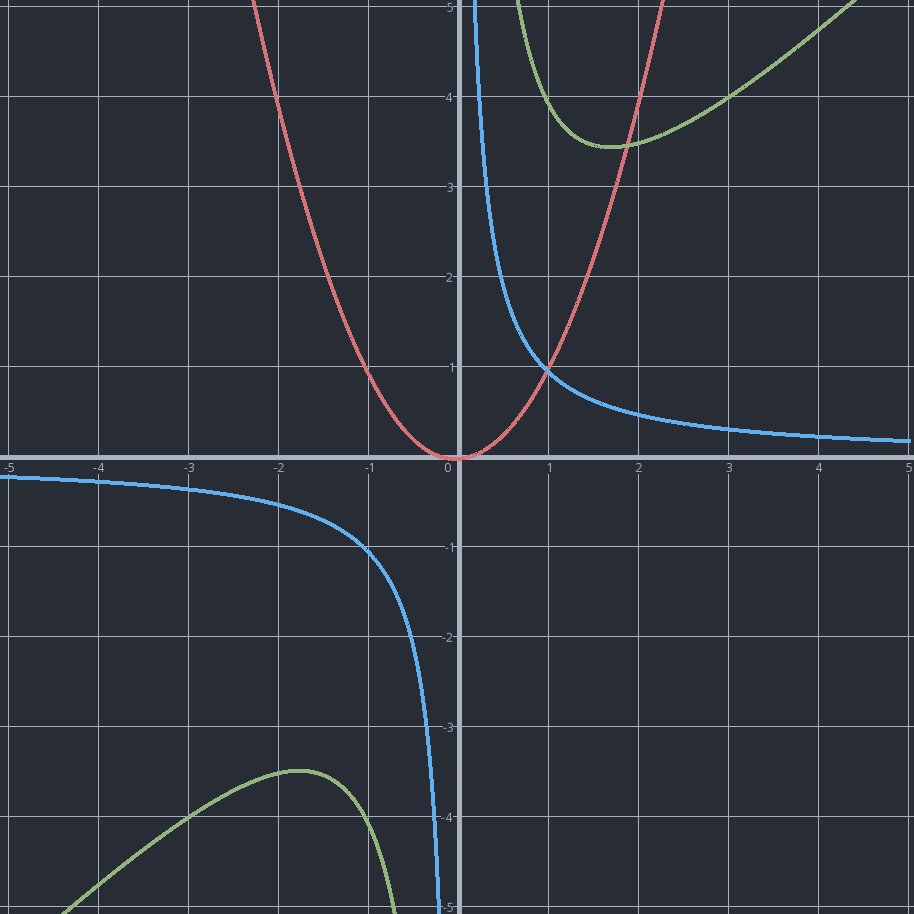
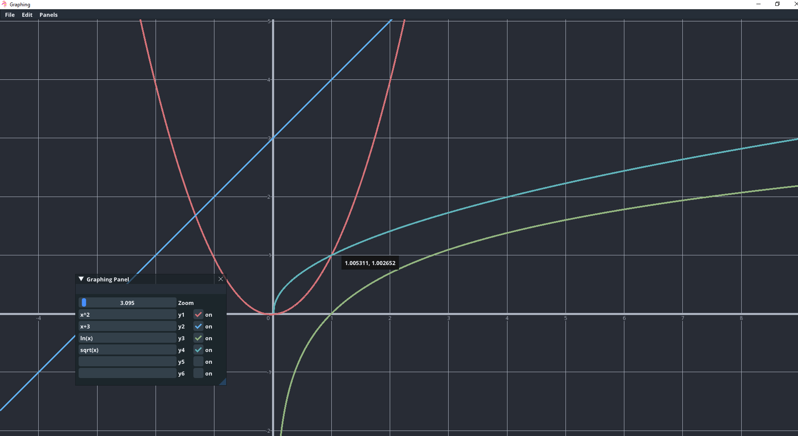
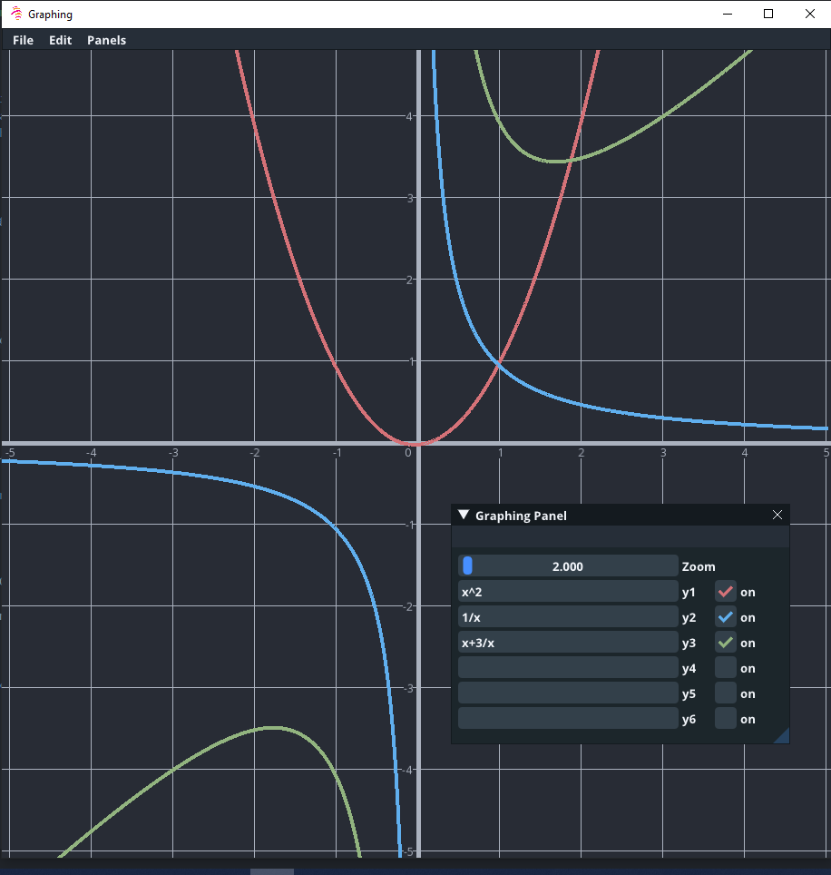
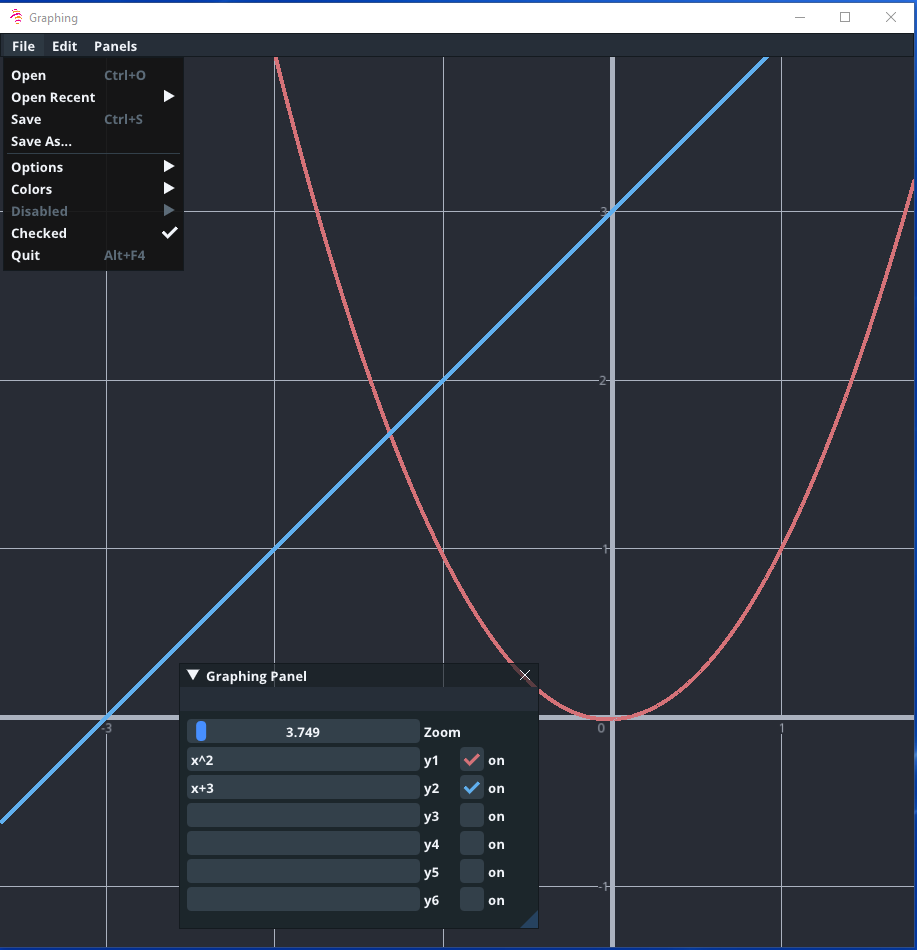

# CurveScape

CurveScape is a lightweight, colorful graphing application and graphing calculator
focused on efficiency and usability. Type in mathematicsl functions (e.g. sin(x)) 
to **instantly** generate interactive, vibrant graphs.

## Features
- High performance with instant graphing
- Modern UI based on Github Atom
- OpenGL based graphs (cross platform support coming soon)
- Save and load graphs easily
- Export graphs in image formats
- Customize colors (coming soon)
- Explore coordinate plane with zoom and pan tools

# Install
Download the binary (CurveScape.executableformat) located in the ```bin``` folder 
for your operating system and run the application.

# Photos





# About .graph Files
Graph files are XML-based files used by CurveScape to load and save generated graphs. Although they
can be edited with any ordinary text editor, altering their contents may corrupt the files. Any modifications
should be done through the application itself.

# Configuration
To open a saved .graph file, used ```File``` -> ```Open``` and a file dialog should pop up. Alternatively,
one may type in the name of the executable in a terminal and pass the path of the file as a command line 
argument. Taking advantage of this feature, one may create "file associations" on Windows to double click
on .graph files and open them directly in the application.

## Note 
CurveScape is stil in its **early stages of development**. The current version is 0.0.1,
meaning that it likely has bugs. If you find a bug, please create an issue! Major changes
to CurveScapes calculation capabilities, graphing system, UI, and more are still to come.